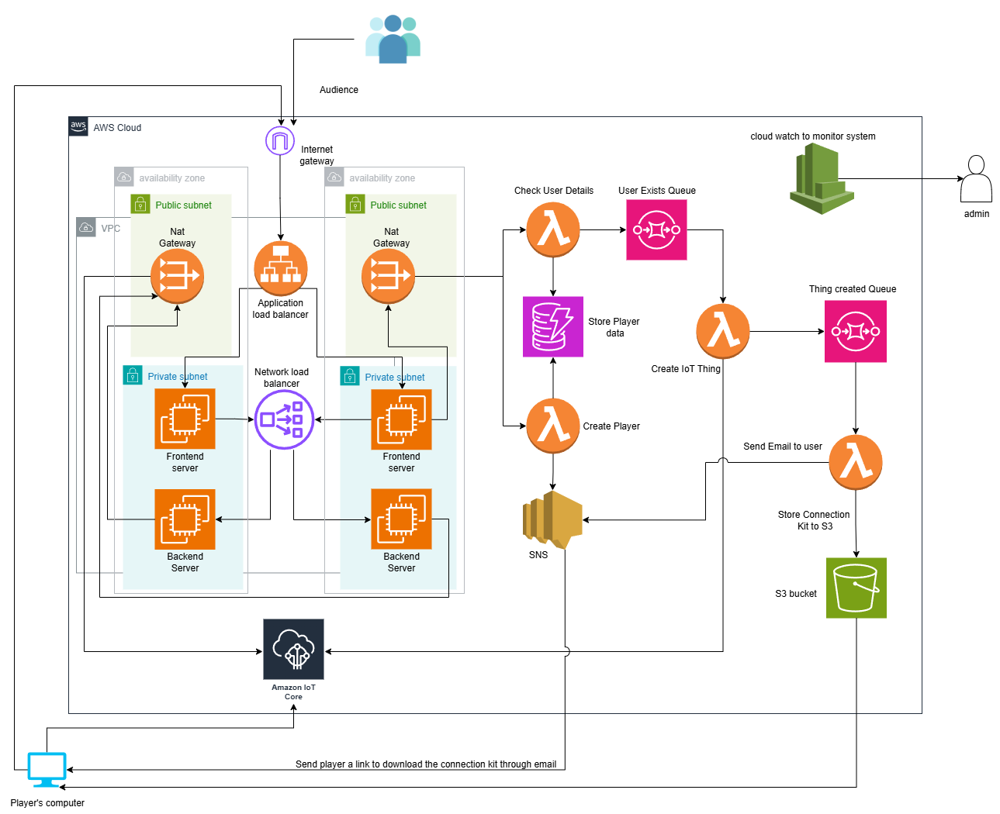
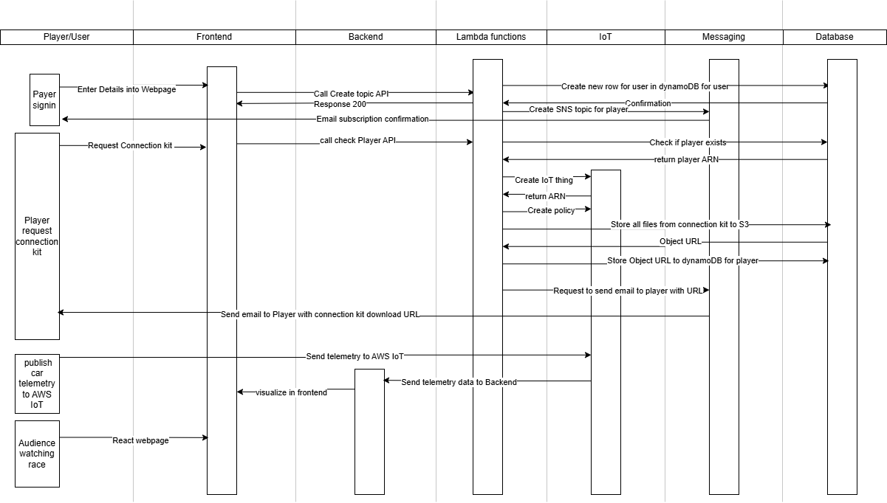
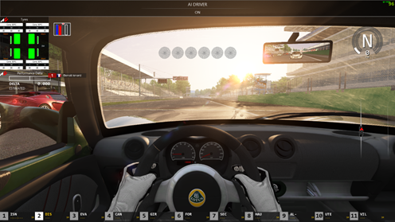
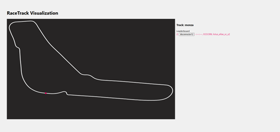
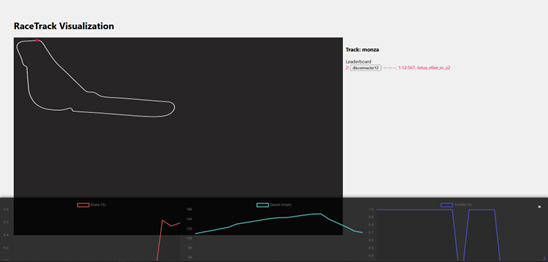
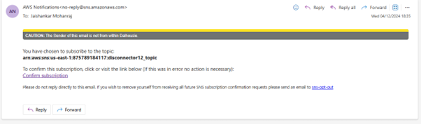
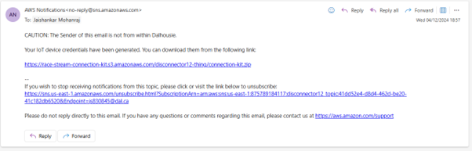
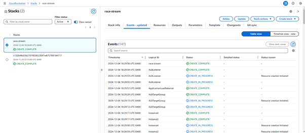

# Real-Time Race Simulation Analytics on AWS Cloud

## 📌 Introduction

This project is an **IoT-based visualization tool** that extracts data from the **Assetto Corsa** race simulator and visualizes it on a **React-based website** in real time.

---

## 🎯 Purpose of the Application

The application provides viewers with a visualization of race events including:

- Car positions on the track
- Live leaderboard
- Driver inputs (gas, brake, car speed)

It focuses on races simulated in **Assetto Corsa**.

---

## 🛠️ Technologies Used

- **Assetto Corsa** – Race simulation software
- **Python** – Extracts physics data and publishes to AWS IoT
- **NodeJS** – Backend WebSocket server
- **React** – Frontend web application
- **MQTT** – Data transfer protocol

---

## ☁️ AWS Services Justification

### Compute

- **EC2:** Cost-effective, scalable compute for frontend/backend servers.
- **Lambda:** Event-driven tasks like racer registration.

### Storage

- **S3:** Stores racer connection kits securely with lifecycle policies.

### Database

- **DynamoDB:** Serverless NoSQL, cost-effective for low-frequency reads/writes.

### Networking & Content Delivery

- **VPC:** Logical isolation with public/private subnets and security groups.
- **ALB:** Distributes user traffic across frontend servers, integrates with WAF.
- **NLB:** Ultra-low latency backend-to-frontend communication.

### Application Integration

- **SNS:** Sends racer connection kit emails.
- **SQS:** Decouples Lambda functions.

### IoT

- **AWS IoT Core:** Handles telemetry data securely with MQTT.

---

## 📊 Architecture

### Architecture Diagram



### Data Interaction Sequence Diagram



---

## 💻 Application Screenshots

- Homepage  
  
- Racer Signup  
  
- Racer Connection Kit Request  
  
- Race Simulation  
  
- Audience Racetrack View  
  
- Car Telemetry  
  
- Subscription Email  
  
- IoT Download Link Email  
  
- CloudFormation Stack  
  

---

## 🔑 AWS Well-Architected Framework

### Operational Excellence

- **CloudFormation (IaC):** Full stack deployment in one click
- **EC2 User Data:** Automated Docker setup with latest images

### Security

- **VPC & Subnets:** Instances in private subnets behind NAT gateways
- **Security Groups:** Principle of least privilege
- **WAF & Load Balancers:** Extra layer of protection
- **Encryption:** Data secured at rest and in transit
- **IoT Policies:** Fine-grained access for players

### Reliability

- **Multi-AZ Deployments** for high availability
- **AWS Managed Services** ensure resilience and redundancy

### Performance Efficiency

- **IaC for rapid deployments**
- **Load Balancers** optimize performance
- **Serverless scaling** via Lambda

### Cost Optimization

- **Pay-as-you-go model** with managed services
- **Right-sized EC2 instances** for events

### Sustainability

- **On-demand deployments** (launch only during races)
- **Managed services** reduce energy footprint

---

## ⚙️ Infrastructure as Code (IaC)

**CloudFormation Stack includes:**

- **S3 Bucket** (stores connection kits)
- **DynamoDB Table** (player info)
- **Lambda Functions** (sign-in, IoT device creation)
- **SQS Queues** (function orchestration)
- **VPC with subnets, NAT, IGW**
- **EC2 Instances** (frontend & backend)
- **ALB & NLB** (traffic management)

> **Note:** After running the stack, you must upload `root-CA.crt` to the `Root-certificate` S3 folder.

Example CloudFormation command:

```bash
aws cloudformation create-stack \
  --stack-name race-analytics-stack \
  --template-body file://template.yaml \
  --capabilities CAPABILITY_NAMED_IAM
```
